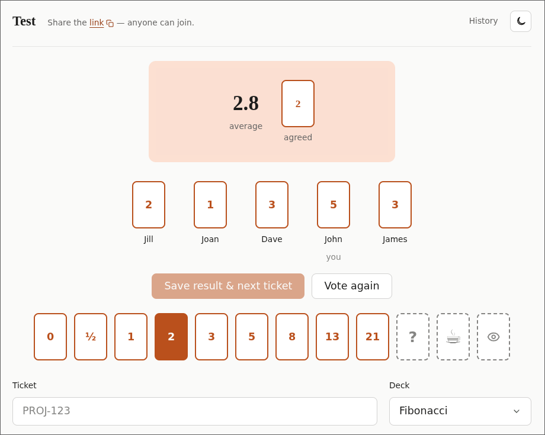

# Planning poker

[](https://github.com/dbalmain/planning-poker/actions/workflows/ci.yml)
[](https://planning-poker.davebalmain.me)

A small planning-poker table. Create a session, share the URL, people join with
a display name, vote in private, reveal together, then save who voted what
against a ticket id.

[Try it live](https://planning-poker.davebalmain.me). No accounts — the board id
is 128 bits of randomness; treat the URL as the secret.



It runs on Cloudflare: a Worker serves the UI and API, a Durable Object holds
each live table, and D1 stores saved history. A daily cron deletes sessions that
have not been used for two weeks — history included. The current ticket (votes,
phase, the ticket field) is not stored in D1. Saving a result keeps only that
completed round; starting the next ticket throws the live hand away.

## How a session works

1. Create a session (optional name, pick a deck).
2. Share the link. Everyone types a name. `👀` watches without voting.
3. Name the current ticket (e.g. a Jira id).
4. Vote. You can change your card until the hand is saved. Anyone at the table
   can reveal. `?` (don't understand the ticket) and `☕` (out for this round)
   show immediately, same dashed style as `👀`; numbers stay hidden. `☕` sits
   the round out and drops you from the voter count. `?` keeps you in the count
   but is not a vote.
5. After the reveal, votes stay face-up and people can still change them while
   you discuss. The table shows the average. **Pick agreed estimate** locks
   votes; then choose the agreed card and **Save result & next ticket**.
   Individual votes are stored with the agreed value. `☕` stays put if you vote
   again; number votes are cleared.
6. Repeat for the next ticket. Open **History** (next to the theme toggle) to
   see every saved round and who voted what. Unsaved work from the previous
   ticket is gone.

The deck can be changed on the table at any time. Cards that are not in the new
deck are dropped.

Built-in decks: Fibonacci (includes `½`), modified Fibonacci, powers of 2,
T-shirt. Every deck includes `?` and `☕`. `👀` is the spectator toggle, not a
card.

## Run it

Needs Node 22+.

```sh
npm install
npm run types      # regenerates worker-configuration.d.ts from wrangler.jsonc
npm test
npm run dev
```

`npm run dev` applies the D1 migrations to the local database before starting
Vite. Run `npm run db:migrate` directly when you only want to update the local
database.

Then open the URL Vite prints (usually <http://127.0.0.1:5173/>).

## Where things live

| To change…                                   | Edit                                         |
| -------------------------------------------- | -------------------------------------------- |
| a game rule (voting, reveal, spectators)     | `shared/game.ts`                             |
| the cards on offer                           | `shared/deck.ts`                             |
| a wire message or response shape             | `shared/protocol.ts`                         |
| a URL shape                                  | `shared/routes.ts`                           |
| an error message users see                   | `shared/errors.ts`                           |
| an HTTP endpoint                             | `worker/index.ts`                            |
| live-table behaviour (WebSockets, broadcast) | `worker/room.ts`                             |
| a SQL query                                  | `worker/db.ts`                               |
| the session expiry sweep                     | `worker/cleanup.ts`                          |
| the database schema                          | a new `migrations/*.sql`                     |
| anything the browser renders                 | `src/main.ts`                                |
| app styling                                  | `src/styles/app.css`                         |
| deployment                                   | `wrangler.jsonc`, `.github/workflows/ci.yml` |

`shared/` is the only code both the Worker and the browser import, so it must
not reference `D1Database`, `DurableObject`, `document` or `localStorage`.

`migrations/` is the **only** definition of the schema — the Worker does not
create tables at runtime. Adding a column means adding a migration.

## Deploy

Every push to `main` runs
[`.github/workflows/ci.yml`](.github/workflows/ci.yml), which gates on
`npm run check`, applies D1 migrations, deploys the Worker, and smoke-tests the
result. The live site is <https://planning-poker.davebalmain.me>.

Dependabot opens a weekly grouped PR for npm and another for GitHub Actions.
[`.github/workflows/dependabot-auto-merge.yml`](.github/workflows/dependabot-auto-merge.yml)
squash-merges those PRs once CI is green, so the stack does not rot. A bump that
fails `npm run check` sits unmerged.

### One-time setup

```sh
npx wrangler login
npx wrangler d1 create planning-poker
```

`wrangler d1 create` appends a `database_id` to `wrangler.jsonc` — **delete
it**. This repo is public, so no account-specific ids are committed; note the id
and add it as a variable instead. Local development and both test suites use
miniflare's local D1 and need no id at all.

Then add one repository **secret** and two **variables** (Settings → Secrets and
variables → Actions, or on the `production` environment):

| Kind     | Name                    | Value                                    |
| -------- | ----------------------- | ---------------------------------------- |
| Secret   | `CLOUDFLARE_API_TOKEN`  | a scoped API token — see the table below |
| Variable | `CLOUDFLARE_ACCOUNT_ID` | from `wrangler whoami`                   |
| Variable | `D1_DATABASE_ID`        | from `wrangler d1 list`                  |

The API token (My Profile → API Tokens → Create Custom Token) needs:

| Scope                   | Permission             | Needed for                           |
| ----------------------- | ---------------------- | ------------------------------------ |
| Account                 | Workers Scripts: Edit  | the Worker, its DO migration, assets |
| Account                 | D1: Edit               | `d1 migrations apply --remote`       |
| Account                 | Account Settings: Read | account lookup                       |
| Zone (`davebalmain.me`) | Workers Routes: Edit   | binding the custom domain            |
| Zone (`davebalmain.me`) | DNS: Edit              | creating the `planning-poker` record |

The custom domain is declared in `wrangler.jsonc` under `routes`, so the first
deploy creates the DNS record itself — nothing to click in the dashboard.

### Deploying by hand

```sh
export D1_DATABASE_ID=...   # only needed for remote deploys
npm run deploy
```

That builds, injects the database id into the generated (gitignored) Worker
config, applies remote migrations, then deploys — the same order CI uses.
Migrations run **before** the Worker goes live, because the Worker no longer
creates tables at runtime and would otherwise serve errors until they caught up.

The cleanup cron runs daily at 04:00 UTC and deletes any session whose
`last_used_at` is older than 14 days, history included.

## Design system

UI styles follow the shared ai-tools design system
([`~/w/ai-tools/style`](../ai-tools/style)):

- `src/styles/tokens.css` and `src/styles/components.css` are **vendored** —
  never edit them by hand.
- Re-sync with:

  ```sh
  ~/w/ai-tools/bin/sync-style src/styles
  ```

- App-only rules live in `src/styles/app.css` and use **tier-2 semantic tokens**
  only (`--color-*`, `--space-*`, `--font-*`, …).
- Dark mode is `data-theme="dark"` on `<html>` (sun/moon toggle in the header).
  The first visit follows `prefers-color-scheme`; after that the choice is
  stored in `localStorage`.

## Checks

```sh
npm run check      # what CI gates on: typecheck, both test suites, build
```

Or individually:

```sh
npm test           # fast unit suite, then the workers-pool integration suite
npm run typecheck
```
